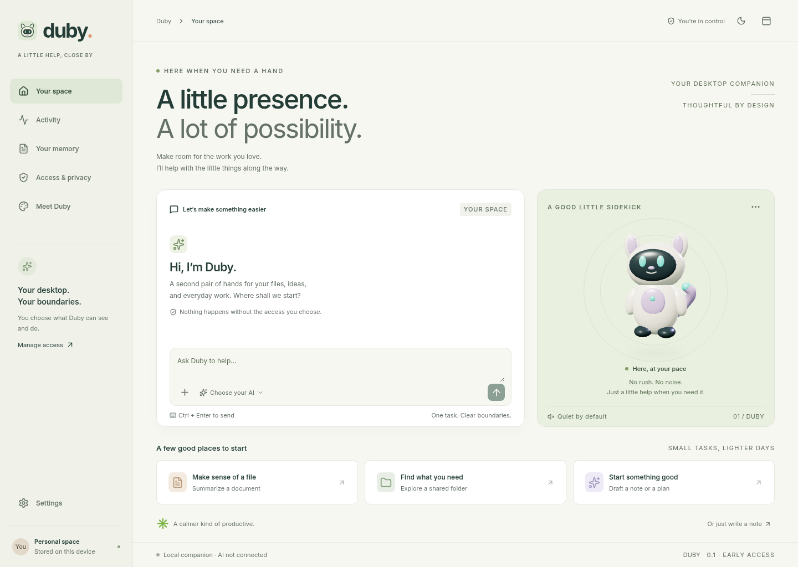

<div align="center">

<h1>Duby</h1>
<p>A little presence. A lot of possibility.</p>
<p>An original 3D Linux desktop companion with scoped file tools and your choice of AI.</p>
</div>



**Development alpha.** This repository contains a running Tauri application, original
rigged character assets, a Rust permission broker, and a tested OpenClaw integration.
It does **not** yet satisfy the entire flagship specification. GNOME/KDE Wayland
anchoring, screen/input automation, voice, and signed updates remain release gates.
See [the exact status and evidence](docs/STATUS.md), rather than interpreting the
[target specification](docs/SPECIFICATION.md) as a list of completed features.

## What you can do

- Open a native Linux app and separate floating 3D companion with twelve animation clips.
- Share a specific folder for five minutes, one hour, or eight hours; read and find text files; create
  new files without overwriting existing ones. Revoke access at any time.
- Run file-summary and drafting tasks through a managed OpenClaw runtime. The model
  uses three narrow tools; it cannot use an alternate shell or filesystem route.
- Pause new file operations, stop a turn, see real operation outcomes, and keep
  user-approved memories on your device. Memories are shared only when you select them.
- Reopen saved conversations without replaying their tasks; retain model settings
  and opt into desktop autostart. Folder grants expire at app exit.
- Use light/dark themes, reduced motion, an animation gallery, keyboard navigation,
  a still-render atlas fallback, and redacted diagnostic export.
- Configure OpenAI, Anthropic, Gemini, native Ollama, or a custom OpenAI-compatible
  endpoint. Hosted inference needs your own credentials and may cost money.

The app works offline for its interface, character, granted deterministic file
operations, and memory. AI reasoning needs a configured provider or an already
installed local model. No model, paid account, API subscription, or cloud credit
is bundled. Local routing is not an OS-level network isolation guarantee.

## Run from source

The validated build machine is Debian 13.6 x86_64, Node 24.19.0, Rust 1.99.0,
GTK 3.24.49 and WebKitGTK 2.54.0. Normal Debian development prerequisites:

```bash
sudo apt-get update
sudo apt-get install -y build-essential pkg-config libssl-dev \
  libwebkit2gtk-4.1-dev libappindicator3-dev librsvg2-dev patchelf libsecret-tools
npm ci
npm run desktop
```

Install the pinned Node version in `.nvmrc` and a compatible Rust toolchain first.
`npm run dev` is only the interface development server; it deliberately cannot
access files or AI. The native app exposes a narrow validated Tauri API.

For this Codex cloud snapshot, run `source /workspace/toolchains/activate.sh` before
building. [Cloud setup](docs/DEVELOPMENT.md) explains the unprivileged sysroot and
X11 test-display invocation. It is development infrastructure, not a user installer.

## Connect AI

1. For local inference, install Ollama separately and pull a capable non-cloud model.
   Select **Ollama** in Settings and enter its exact model ID. Native `/api/chat`
   is used; do not append `/v1` to the Ollama URL.
2. For a hosted provider, store your key using Linux Secret Service:

   ```bash
   duby credentials openai       # or anthropic, google, custom
   ```

   From a development build use `target/debug/duby credentials openai`. The key is
   entered through `secret-tool` in the terminal, never in renderer state. A locked
   or absent keychain can also use **Use a key for this session**, a native masked
   dialog. The key stays in background memory until you quit or forget session keys.
3. Select the provider and model, then **Connect runtime**. This authenticates the
   managed Gateway. Inference is checked when you send a task, not by a hidden
   billable test. Hosted requests may incur charges on your own provider account.
4. Share a folder under **Access & privacy**. Read-only access is enough for search
   and questions. Grant creation access to save a new summary. Existing filenames
   are never overwritten. If the system folder picker is unavailable, use **Enter
   a folder path instead** and confirm the exact scope in the native dialog.
5. Try: `Read meeting.txt, summarize the decisions, and create summary.md.`

Duby owns a separate runtime under its XDG application data directory. It does not
adopt or modify an existing `~/.openclaw` installation. No gateway listens publicly.

## Validate and package

```bash
npm run check                         # frontend build, contract tests, GLB validation
cargo test -p duby-broker --locked      # policy, real filesystem and SQLite tests
cargo clippy --workspace --all-targets --locked -- -D warnings
npm run test:e2e                       # Chromium UI + automated accessibility checks
npm run test:runtime                   # real authenticated Gateway handshake
npm run test:flow                      # real Gateway/plugin/broker, fixture model
node tests/runtime-security.mjs        # model-requested alternate exec route denied
npm run package                       # Node/OpenClaw included; .deb and .rpm
```

Browser checks default to `/usr/bin/chromium`; set `CHROMIUM_PATH` if needed.
Blender is needed only to regenerate artwork: `npm run assets` (Blender 4.3.2).
The editable `.blend`, exported GLB, renders, atlas, and provenance are committed.

Packages are generated in `.artifacts/packages/`. They include a normal installed
OpenClaw dependency tree and an actual Node executable, preserving exports and
licenses. The app and settings open without a code download, development toolchain,
or Blender. Native host WebKitGTK dependencies still apply. Packages built on
Debian 13 require that ABI baseline; an RPM file alone does not establish Fedora
compatibility. The AppImage also requires host WebKitGTK 4.1; it does not remove
this ABI baseline. ARM64 and signed updates remain open.

CI is **manual only** (`workflow_dispatch`); this build did not trigger billed
GitHub Actions. The source and complete development history are published at
[sidmuzammil/DUBY](https://github.com/sidmuzammil/DUBY). A portable Git bundle and
generated installers are preserved in `.artifacts/packages/` in the build workspace.
No downloadable GitHub Release or installer assets have been published yet.

## Read more

- [Architecture and data ownership](docs/ARCHITECTURE.md)
- [Build report and publishing status](docs/BUILD-REPORT.md)
- [Security boundary and limitations](docs/SECURITY.md)
- [Compatibility and remaining release gates](docs/STATUS.md)
- [Development, packaging and recovery](docs/DEVELOPMENT.md)
- [Pinned upstream audit](docs/upstream-manifest.json)
- [Asset provenance](assets/duby/provenance.json)
- [Third-party notices](THIRD_PARTY_NOTICES.md)

First-party source is MIT licensed. Original Duby artwork is CC BY 4.0.
Coucou was audited as an architectural reference; none of its restricted character,
icon, animation, sound or media assets are shipped. OpenClaw remains an unmodified,
credited MIT dependency. No trademark clearance is asserted.
