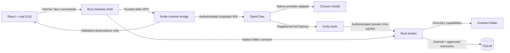

# Architecture and ownership

Duby is a native Tauri 2 shell, a React/Three.js presentation layer, a Rust execution
broker, and a background Node host supervising a pinned OpenClaw Gateway.

The renderer has no generic filesystem, shell or HTTP permission and no provider
credentials. Remote content is rendered as text, not HTML. The broker knows only
`duby_read`, `duby_find`, and `duby_save`; there is no command fallback.

| Entity | Authority / storage |
| --- | --- |
| Conversations, agent turns, upstream run status | OpenClaw; supported `chat.send`, `chat.abort`, `chat.history` APIs |
| Provider credentials | Linux Secret Service or native session-key dialog; background-only resolution; OpenClaw env SecretRefs |
| Gateway bootstrap token | Fresh per owned runtime child; background memory only |
| Provider selection / explicit model metadata | Validated background config in Duby's own runtime directory |
| Grants and task admission | Rust broker; session-only capabilities, expiry and revocation checked per action |
| Operation identity and result | SQLite execution journal; task + call ID + arguments, no implicit retries |
| User-approved memories | Separate SQLite table; explicit add/edit/delete; only selected context enters a task |
| Task index / run mapping | SQLite ID, run ID, short title, observed status and timestamps; never restores authority |
| Conversation bodies / pet state / timeline | Rebuildable projection; saved bodies read from OpenClaw history, never execution triggers |
| Theme and reduced-motion preferences | Local WebView storage; no credentials or authoritative conversations |
| Integration connections / scheduled tasks | Not implemented or enabled in this alpha |

The Gateway is an owned child, not a discovered external installation. A distinct
configuration and state path, random loopback port and fresh bootstrap credential
prevent silent adoption. The public client performs wire-v4 challenge authentication;
only operator read/write scopes and tool events are requested. Because this is a
background client to an owned local Gateway, remote device pairing is not exposed.

OpenClaw owns streaming assembly and dispatch. Duby observes lifecycle events and
maps runtime-supplied session identity to an already admitted broker task. Model
arguments cannot supply task identity, roles, grants, or an approval bit. Duplicate
agent/chat sequence cursors are separate; tool result events do not complete tasks.

Disconnect pauses new broker work. The reference client reconnects with bounded
attempts; history is queried before presenting recovered state. Mutations are never
automatically resent. On restart, saved task metadata is available immediately and
incomplete tasks become interrupted. After an explicit runtime connection, opening
a saved task queries `chat.history` without resending a prompt. Session grants never
survive restart. Validated provider/model preferences contain no credentials.
The managed runtime is stopped on normal shutdown, then killed after a bounded grace
period. Cold runtime startup failures surface explicitly, without a repair loop.

The SQLite schema is versioned. Future schema versions must be rejected, not silently
opened for writes. Artifacts are verified with actual operation receipts and SHA-256
for newly created files; a sent prompt is never a success signal.
